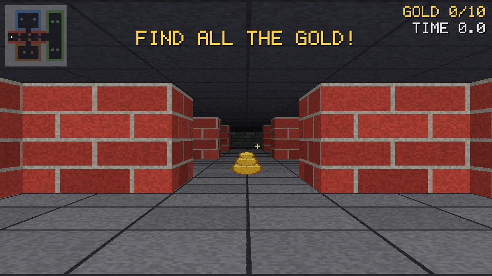

# Raycaster from scratch (pure C)

A Wolfenstein 3D–style software raycaster written from scratch in a single C
file. No engine, no third-party libraries, no asset files — the only external
calls are to the OS itself (`user32`/`gdi32`) to open a window and copy a
finished framebuffer to the screen. Everything you see is computed by hand,
every frame, on the CPU.



## Everything is hand-made

| Piece | Where |
|---|---|
| Ray marching (DDA grid traversal) | `render_frame()` |
| Perspective wall projection + texture mapping | `render_frame()` |
| Textured floor & ceiling casting | `render_frame()` |
| Distance fog + directional shading | `fogf()`, `shade()` |
| Procedural textures — brick, stone, wood, metal, moss (no image files) | `gen_textures()` |
| The world map, built from wall primitives | `gen_map()` |
| Collision detection with wall sliding | `blocked()`, `update()` |
| Raw-input mouse look with cursor capture | `wndproc()`, `capture_mouse()` |
| Minimap overlay with alpha blending | `render_frame()` |
| High-resolution frame timing | `now_seconds()` |
| BMP screenshot encoder, byte by byte | `save_bmp()` |

## Controls

| Key | Action |
|---|---|
| Mouse | turn (raw input, FPS-style capture) |
| `W` / `S` | move forward / back |
| `A` / `D` | strafe left / right |
| `←` / `→` | turn (keyboard alternative) |
| `Alt+Tab` | release the mouse without quitting |
| `Esc` | quit |

## Build

Any C compiler works. With [w64devkit](https://github.com/skeeto/w64devkit)
or any MinGW GCC:

```
gcc -O2 -Wall -Wextra -o raycaster.exe raycaster.c -luser32 -lgdi32
```

With MSVC:

```
cl /O2 raycaster.c user32.lib gdi32.lib
```

Or just run `build.bat`.

## Run

```
raycaster.exe                    play
raycaster.exe --screenshot f.bmp render one frame to f.bmp, then exit
raycaster.exe --selftest 5       run for 5 seconds, print avg FPS, then exit
```

## How it works

The world is a 24×24 grid of cells. For every one of the 960 screen columns,
one ray leaves the player and steps cell to cell with a DDA traversal —
always advancing to whichever grid line (vertical or horizontal) is closer —
until it hits a wall. The *perpendicular* distance to that hit (not the
Euclidean one, which would fisheye) sets the height of the wall slice drawn
in that column, and the hit position along the wall selects the texture
column to sample. Floors and ceilings are drawn per *scanline* instead: each
row below the horizon corresponds to one fixed distance on the ground plane,
so the texture coordinate can be stepped linearly across the row. That's the
whole trick from 1992 — no 3D models, no GPU, one wall slice per column at
several hundred frames per second on a modern CPU.

## Roadmap

- Sprites (barrels, enemies) with a per-column depth buffer
- Sliding doors and secret walls
- Sound via `waveOut` (still no libraries)
- Multithreaded column rendering
